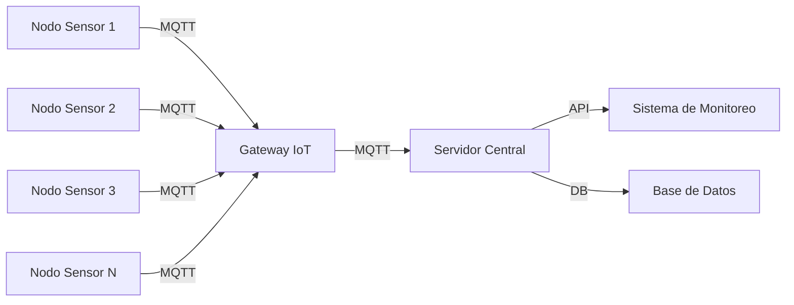

# Documento SRS - Sistema de Comunicación IoT Industrial

## Control de Versiones

| Versión | Fecha | Autor | Descripción de Cambios |
|---------|--------|-------|------------------------|
| 1.0 | 2025-04-15 | - | Versión inicial en formato Word |
| 2.0 | 2025-04-19 | - | Conversión a Markdown, adición de sección de monitoreo de rendimiento, diagrama de arquitectura, y matriz de trazabilidad |

## 1. Introducción y Alcance

Este documento especifica los requerimientos para el desarrollo de un firmware especializado para un sistema de comunicación inalámbrica en un entorno industrial IoT. El firmware tiene como objetivo principal conectar sensores remotos distribuidos en una planta de manufactura, garantizando la transmisión segura y en tiempo real de datos críticos al servidor central para su monitoreo y análisis. Este documento se enfoca en definir las funciones, restricciones, criterios de validación y dependencias del sistema.

## 2. Descripción General

El sistema estará basado en un microcontrolador ARM de bajo consumo, y será programado en lenguaje C. Estará compuesto por múltiples nodos sensores, conectados vía protocolo MQTT a un servidor central. El firmware incluirá módulos para comunicación, cifrado, corrección de errores, y gestión de energía. El entorno presenta desafíos como interferencias electromagnéticas, lo cual exige robustez en la transmisión de datos.

### 2.1 Arquitectura del Sistema

## 3. Requerimientos Funcionales

* **RF01**: El sistema deberá establecer conexión MQTT con el servidor al inicio del ciclo de transmisión.
* **RF02**: Los sensores deberán transmitir sus lecturas cada 30 segundos o cuando se detecte una condición crítica.
* **RF03**: El firmware deberá cifrar los datos antes de enviarlos.
* **RF04**: El firmware debe aplicar algoritmos de corrección de errores para garantizar integridad en la transmisión.
* **RF05**: En caso de pérdida de conexión, los datos deberán almacenarse temporalmente y reenviarse una vez restablecida.
* **RF06**: [NUEVO] El sistema deberá generar logs de diagnóstico con niveles de criticidad configurables.
* **RF07**: [NUEVO] El firmware implementará actualizaciones OTA (Over-The-Air) con verificación de integridad.

## 4. Requerimientos No Funcionales

* **RNF01**: El consumo energético del firmware no deberá superar los 100 mW en operación activa.
* **RNF02**: El tiempo de respuesta entre detección y transmisión de un evento no debe exceder los 3 segundos.
* **RNF03**: El sistema deberá soportar ambientes con interferencia electromagnética (EMI) alta sin pérdida de datos.
* **RNF04**: El firmware debe ser portable a distintas versiones de microcontroladores ARM de 32 bits.
* **RNF05**: [NUEVO] El sistema deberá cumplir con el estándar IEC 62443-4-2 para dispositivos industriales IoT.
* **RNF06**: [NUEVO] La tasa de pérdida de paquetes no deberá exceder el 0.1% en condiciones normales de operación.

## 5. Suposiciones y Dependencias

* El servidor central cuenta con compatibilidad MQTT y mecanismos de almacenamiento de datos.
* Se dispone de una infraestructura de red inalámbrica dentro de la planta.
* Las baterías de los sensores tienen una autonomía mínima de 6 meses con el consumo estimado.
* Las condiciones ambientales pueden variar pero se mantienen dentro de los rangos industriales típicos.
* [NUEVO] Se cuenta con un stack TCP/IP compatible con los microcontroladores objetivo.
* [NUEVO] El personal técnico tiene las capacidades para realizar actualizaciones de firmware de manera segura.

## 6. Criterios de Aceptación y Validación

* Pruebas de conexión MQTT con paquetes cifrados exitosos.
* Simulación de fallas en la red para verificar reenvío de datos almacenados.
* Verificación del consumo energético mediante herramientas de análisis del hardware.
* Validación de la robustez del sistema mediante pruebas en cámara anecoica con EMI simulada.
* Validación del ciclo de vida estimado mediante pruebas de uso continuo por al menos 7 días.
* [NUEVO] Validación de actualizaciones OTA exitosas en al menos 10 dispositivos simultáneamente.
* [NUEVO] Pruebas de penetración básicas para validar la seguridad del protocolo de comunicación.

## 7. [NUEVO] Monitoreo de Rendimiento

### 7.1 Métricas Principales

El sistema deberá monitorear y reportar las siguientes métricas:

* Latencia de transmisión de datos
* Tasa de éxito en conexiones MQTT
* Uso de memoria RAM y Flash
* Consumo energético promedio
* Cantidad de reconexiones por día
* Eventos críticos detectados

### 7.2 Alertas y Notificaciones

Se implementarán alertas automáticas para:

* Consumo energético superior al 90% del límite establecido
* Tasa de fallo de transmisión superior al 1%
* Reconexiones frecuentes (más de 5 en 1 hora)
* Detección de condiciones críticas en los sensores

## 8. [ACTUALIZADO] Matriz de Trazabilidad

| ID Requisito | Descripción | Objetivo del Requisito | Pruebas Asociadas | Verificación | Estado |
|--------------|-------------|------------------------|-------------------|--------------|--------|
| RF01 | Conexión MQTT | Garantizar conectividad inicial y estable | TC01: Conexión inicial MQTT   TC02: Reconexión automática | Prueba funcional con simulador MQTT | Pendiente |
| RF02 | Transmisión periódica o crítica | Asegurar envío continuo y en condiciones críticas | TC03: Envío cada 30s   TC04: Envío por evento crítico | Prueba de estrés con eventos simulados | Pendiente |
| RF03 | Cifrado de datos | Proteger datos sensibles en tránsito | TC05: Cifrado AES   TC06: Análisis de tráfico | Verificación con herramientas de sniffing | Pendiente |
| RF04 | Corrección de errores | Mejorar integridad de datos | TC07: Inyección de errores   TC08: Verificación CRC | Simulación con pérdida de paquetes | Pendiente |
| RF05 | Almacenamiento y reenvío | Evitar pérdida de datos en fallas | TC09: Pérdida de red   TC10: Reenvío al reconectar | Desconexión simulada y recuperación | Pendiente |
| RF06 | Logs de diagnóstico | Facilitar mantenimiento y monitoreo | TC11: Registro de logs   TC12: Filtros de criticidad | Verificación en archivo de logs | Pendiente |
| RF07 | Actualizaciones OTA | Mantener firmware actualizado de forma segura | TC13: Envío OTA   TC14: Verificación de integridad | Test en múltiples dispositivos | Pendiente |

---

Última actualización: 2025-04-19

